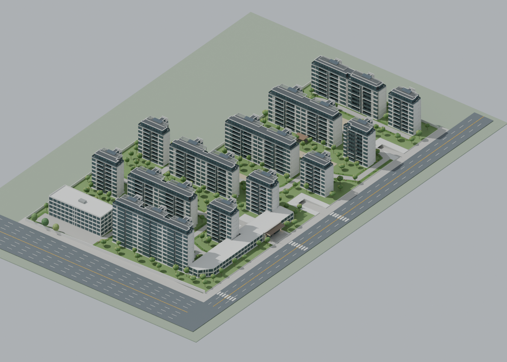

# Guanshanyue Digital Twin · Guanshanyue小区三维模型

基于 Three.js、Blender 和 Vite 的小区三维展示与日照估算，初始模型来自小区建模 V20，公开版本已移除小区外的树木。

**[在线访问](https://seanwong17.github.io/guanshanyue-digital-twin/)** · [采光模拟](https://seanwong17.github.io/guanshanyue-digital-twin/?sun=1)



## 功能

- 小区 14 栋建筑、沿街底商、大门、地库出入口、园路与绿化。
- 旋转、缩放、平移，整体鸟瞰、总平面和楼座定位；楼号默认隐藏。
- 北京时间太阳位置、实时阴影、日出至日落播放、选点直射日照时长估算。
- 手机和桌面浏览器访问；仓库保留 GLB 与可编辑 Blender 模型。

鼠标左键拖动旋转，右键拖动平移，滚轮缩放；触屏单指旋转、双指平移和缩放。

## Windows 桌面版

从 [GitHub Releases](https://github.com/SeanWong17/guanshanyue-digital-twin/releases/latest) 下载 Windows 10/11 x64 安装包 `.exe`，或下载 `.zip` 完整解压后启动 `Guanshanyue.exe`。内置模型，离线可用。安装包未签名，Windows 可能提示未知发布者。

点击“进入小区漫游”，使用 WASD / 方向键行走、Shift 加速，拖动视野转头，Esc 退出。手机可使用屏幕方向按钮和滑动转头。小地图实时显示位置与朝向。视线高为地面以上 1.7 米，楼体轮廓阻挡穿行；目前为地面漫游，不支持上下楼或驶入地下车库。

开发桌面版：`npm run desktop`。在 Windows 上执行 `npm run build`、`npm run package:win` 生成安装包和免安装 ZIP。推送版本标签自动构建、静默安装并验收桌面包，通过后发布 Release。

## 本地运行

需要 Node.js 22 或更新版本。

```sh
npm ci
npm run dev
```

```sh
npm test
npm run build
npm run preview
```

浏览器验收：先启动预览服务，再运行 `npx playwright install chromium` 和 `npm run test:browser`。可用 `PREVIEW_URL` 指定已部署的网站地址。

构建结果在 `dist/`，可部署到任意静态托管服务，支持子目录。推送 `main` 自动经 GitHub Actions 部署到 GitHub Pages；新仓库需将 Pages 来源设置为 GitHub Actions。

## 预览链接

- `?building=1` 至 `?building=14`：对应楼栋，追加 `&sun=1` 开启采光。
- `?view=top`：总平面。
- `?area=gate`、`?area=garden`、`?area=shops`：大门、庭院、底商。
- `?area=garage-main`、`?area=garage-secondary`：主、次地库入口。

## 模型与维护

- `output/community_v1.blend`：可编辑模型源文件；用 Blender 编辑后导出同名 GLB。
- `output/community_v1.glb`：网页直接加载的模型，约 40 MB，首次打开需等待下载。
- `data/site_v2.json`：楼座位置、轮廓、层数和估算高度；改动建筑后应同步该数据，以保证阴影代理一致。
- `viewer.js`：场景和镜头；`sunlight.js`：阴影与交互；`solar.js`：太阳位置计算。
- `output/` 下的 PNG 是静态渲染图，编辑模型后需重新渲染。

本仓库发布网页源码、模型源文件及渲染结果，建模过程中的照片、手工标注、历史备份和临时核对文件未收录。

完整楼层不包含顶部退台层：1、2、4、5、12、13 号为 8+1 层；3、7、8、9、10、11 号为 7+1 层；6 号为 10+1 层。层高约 3–3.1 米，并非实测。14 号为配套建筑。

## 日照估算范围

默认位置为济南 36.65°N、117.12°E，图面向上为北，可在界面调整。以楼体轮廓、退台和估算高度计算遮挡，按 10 分钟采样；暂不计门窗细节、树木、邻区及山体遮挡。结果不代表室内照度或正式日照测量。

## 许可与致谢

本仓库原创代码和模型按 [MIT License](LICENSE) 发布。太阳位置计算参考 [building-sunlight-simulator](https://github.com/SeanWong17/building-sunlight-simulator)，保留其 [MIT 许可](licenses/building-sunlight-simulator.txt)。Three.js 与 Vite 均为 MIT 许可依赖。
